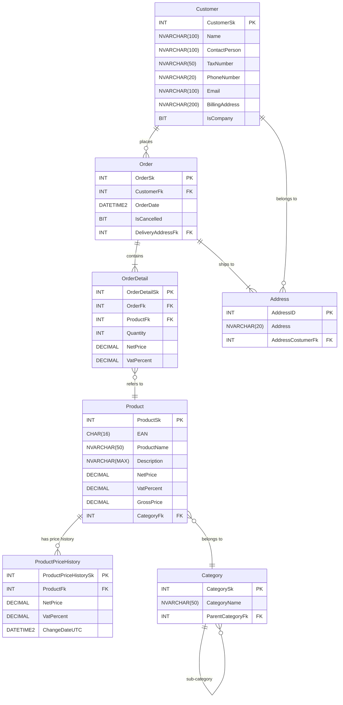

# Adatbázis terv

CREATE TABLE Category (
    CategorySk INT IDENTITY(1,1) PRIMARY KEY,
    CategoryName NVARCHAR(50) NOT NULL,
    ParentCategoryFk INT NULL,
    CONSTRAINT FK_Category_ParentCategory FOREIGN KEY (ParentCategoryFk) REFERENCES Category(CategorySk)
);

CREATE TABLE Customer (
    CustomerSk INT IDENTITY(1,1) PRIMARY KEY,
    Name NVARCHAR(100) NOT NULL,
    ContactPerson NVARCHAR(100),
    TaxNumber NVARCHAR(50),
    PhoneNumber NVARCHAR(20),
    Email NVARCHAR(100) NOT NULL UNIQUE,
    BillingAddress NVARCHAR(200) NOT NULL,
    IsCompany BIT NOT NULL
);

CREATE TABLE Product (
    ProductSk INT IDENTITY(1,1) PRIMARY KEY,
    EAN CHAR(16),
    ProductName NVARCHAR(50) NOT NULL,
    Description NVARCHAR(MAX),
    NetPrice DECIMAL(18,2) NOT NULL CHECK (NetPrice >= 0),
    VatPercent INT NOT NULL CHECK (VatPercent BETWEEN 0 AND 100),
    GrossPrice DECIMAL(18,2) NOT NULL CHECK (GrossPrice >= 0),
    CategoryFk INT NOT NULL,
    CONSTRAINT FK_Product_Category FOREIGN KEY (CategoryFk) REFERENCES Category(CategorySk)
);

CREATE TABLE ProductPriceHistory (
    ProductPriceHistorySk INT IDENTITY(1,1) PRIMARY KEY,
    ProductFk INT NOT NULL,
    NetPrice DECIMAL(18,2) NOT NULL CHECK (NetPrice >= 0),
    VatPercent INT NOT NULL CHECK (VatPercent BETWEEN 0 AND 100),
    ChangeDateUTC DATETIME2 NOT NULL,
    CONSTRAINT FK_ProductPriceHistory_Product FOREIGN KEY (ProductFk) REFERENCES Product(ProductSk)
);

CREATE TABLE Address (
    AddressID INT IDENTITY(1,1) PRIMARY KEY,
    Address NVARCHAR(20) NOT NULL,
    AddressCostumerFk INT NOT NULL,
    CONSTRAINT FK_Address_Customer FOREIGN KEY (AddressCostumerFk) REFERENCES Customer(CustomerSk)
);

CREATE TABLE [Order] (
    OrderSk INT IDENTITY(1,1) PRIMARY KEY,
    CustomerFk INT NOT NULL,
    OrderDate DATETIME2 NOT NULL DEFAULT GETDATE(),
    IsCancelled BIT NOT NULL,
    DeliveryAddressFk INT NOT NULL,
    DiscountPercent INT NOT NULL DEFAULT 0 CHECK (DiscountPercent BETWEEN 0 AND 100),
    TotalAmount DECIMAL(18,2) NULL,
    CONSTRAINT FK_Order_Customer FOREIGN KEY (CustomerFk) REFERENCES Customer(CustomerSk),
    CONSTRAINT FK_Order_Address FOREIGN KEY (DeliveryAddressFk) REFERENCES Address(AddressID)
);

CREATE TABLE OrderDetail (
    OrderDetailSk INT IDENTITY(1,1) PRIMARY KEY,
    OrderFk INT NOT NULL,
    ProductFk INT NOT NULL,
    Quantity INT NOT NULL CHECK (Quantity >= 0),
    NetPrice DECIMAL(18,2) NOT NULL CHECK (NetPrice >= 0),
    VatPercent INT NOT NULL CHECK (VatPercent BETWEEN 0 AND 100),
    CONSTRAINT FK_OrderDetail_Order FOREIGN KEY (OrderFk) REFERENCES [Order](OrderSk),
    CONSTRAINT FK_OrderDetail_Product FOREIGN KEY (ProductFk) REFERENCES Product(ProductSk)
);

SET IDENTITY_INSERT Category ON;

INSERT INTO Category (CategorySk, CategoryName, ParentCategoryFk) VALUES (1, N'Products', NULL);
INSERT INTO Category (CategorySk, CategoryName, ParentCategoryFk) VALUES (2, N'Electronics', 1);
INSERT INTO Category (CategorySk, CategoryName, ParentCategoryFk) VALUES (3, N'Clothing', 1);
INSERT INTO Category (CategorySk, CategoryName, ParentCategoryFk) VALUES (4, N'Home & Garden', 1);

INSERT INTO Category (CategorySk, CategoryName, ParentCategoryFk) VALUES (5, N'Mobile Phones', 2);
INSERT INTO Category (CategorySk, CategoryName, ParentCategoryFk) VALUES (6, N'Laptops', 2);
INSERT INTO Category (CategorySk, CategoryName, ParentCategoryFk) VALUES (7, N'Cameras', 2);

INSERT INTO Category (CategorySk, CategoryName, ParentCategoryFk) VALUES (8, N'Men''s Clothing', 3);
INSERT INTO Category (CategorySk, CategoryName, ParentCategoryFk) VALUES (9, N'Women''s Clothing', 3);
INSERT INTO Category (CategorySk, CategoryName, ParentCategoryFk) VALUES (10, N'Accessories', 3);

INSERT INTO Category (CategorySk, CategoryName, ParentCategoryFk) VALUES (11, N'Furniture', 4);
INSERT INTO Category (CategorySk, CategoryName, ParentCategoryFk) VALUES (12, N'Kitchenware', 4);
INSERT INTO Category (CategorySk, CategoryName, ParentCategoryFk) VALUES (13, N'Gardening Tools', 4);

SET IDENTITY_INSERT Category OFF;