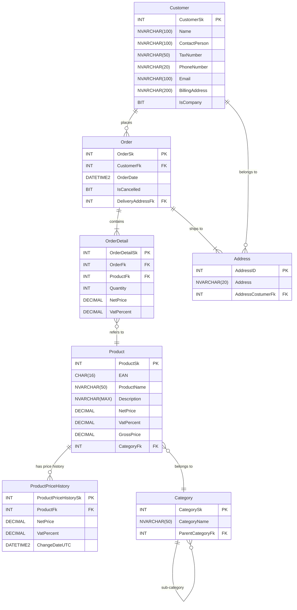

# Adatbázis terv

CREATE TABLE Category (
    CategorySk INT IDENTITY(1,1) PRIMARY KEY,
    CategoryName NVARCHAR(50) NOT NULL,
    ParentCategoryFk INT NULL,
    CONSTRAINT FK_Category_ParentCategory FOREIGN KEY (ParentCategoryFk) REFERENCES Category(CategorySk)
);

CREATE TABLE Customer (
    CustomerSk INT IDENTITY(1,1) PRIMARY KEY,
    Name NVARCHAR(100) NOT NULL,
    ContactPerson NVARCHAR(100),
    TaxNumber NVARCHAR(50),
    PhoneNumber NVARCHAR(20),
    Email NVARCHAR(100) NOT NULL UNIQUE,
    BillingAddress NVARCHAR(200) NOT NULL,
    IsCompany BIT NOT NULL
);

CREATE TABLE Product (
    ProductSk INT IDENTITY(1,1) PRIMARY KEY,
    EAN CHAR(16),
    ProductName NVARCHAR(50) NOT NULL,
    Description NVARCHAR(MAX),
    NetPrice DECIMAL(18,2) NOT NULL CHECK (NetPrice >= 0),
    VatPercent INT NOT NULL CHECK (VatPercent BETWEEN 0 AND 100),
    GrossPrice DECIMAL(18,2) NOT NULL CHECK (GrossPrice >= 0),
    CategoryFk INT NOT NULL,
    CONSTRAINT FK_Product_Category FOREIGN KEY (CategoryFk) REFERENCES Category(CategorySk)
);

CREATE TABLE ProductPriceHistory (
    ProductPriceHistorySk INT IDENTITY(1,1) PRIMARY KEY,
    ProductFk INT NOT NULL,
    NetPrice DECIMAL(18,2) NOT NULL CHECK (NetPrice >= 0),
    VatPercent INT NOT NULL CHECK (VatPercent BETWEEN 0 AND 100),
    ChangeDateUTC DATETIME2 NOT NULL,
    CONSTRAINT FK_ProductPriceHistory_Product FOREIGN KEY (ProductFk) REFERENCES Product(ProductSk)
);

CREATE TABLE Address (
    AddressID INT IDENTITY(1,1) PRIMARY KEY,
    Address NVARCHAR(20) NOT NULL,
    AddressCostumerFk INT NOT NULL,
    CONSTRAINT FK_Address_Customer FOREIGN KEY (AddressCostumerFk) REFERENCES Customer(CustomerSk)
);

CREATE TABLE [Order] (
    OrderSk INT IDENTITY(1,1) PRIMARY KEY,
    CustomerFk INT NOT NULL,
    OrderDate DATETIME2 NOT NULL DEFAULT GETDATE(),
    IsCancelled BIT NOT NULL,
    DeliveryAddressFk INT NOT NULL,
    DiscountPercent INT NOT NULL DEFAULT 0 CHECK (DiscountPercent BETWEEN 0 AND 100),
    TotalAmount DECIMAL(18,2) NULL,
    CONSTRAINT FK_Order_Customer FOREIGN KEY (CustomerFk) REFERENCES Customer(CustomerSk),
    CONSTRAINT FK_Order_Address FOREIGN KEY (DeliveryAddressFk) REFERENCES Address(AddressID)
);

CREATE TABLE OrderDetail (
    OrderDetailSk INT IDENTITY(1,1) PRIMARY KEY,
    OrderFk INT NOT NULL,
    ProductFk INT NOT NULL,
    Quantity INT NOT NULL CHECK (Quantity >= 0),
    NetPrice DECIMAL(18,2) NOT NULL CHECK (NetPrice >= 0),
    VatPercent INT NOT NULL CHECK (VatPercent BETWEEN 0 AND 100),
    CONSTRAINT FK_OrderDetail_Order FOREIGN KEY (OrderFk) REFERENCES [Order](OrderSk),
    CONSTRAINT FK_OrderDetail_Product FOREIGN KEY (ProductFk) REFERENCES Product(ProductSk)
);

SET IDENTITY_INSERT Category ON;

INSERT INTO Category (CategorySk, CategoryName, ParentCategoryFk) VALUES (1, N'Products', NULL);
INSERT INTO Category (CategorySk, CategoryName, ParentCategoryFk) VALUES (2, N'Electronics', 1);
INSERT INTO Category (CategorySk, CategoryName, ParentCategoryFk) VALUES (3, N'Clothing', 1);
INSERT INTO Category (CategorySk, CategoryName, ParentCategoryFk) VALUES (4, N'Home & Garden', 1);

INSERT INTO Category (CategorySk, CategoryName, ParentCategoryFk) VALUES (5, N'Mobile Phones', 2);
INSERT INTO Category (CategorySk, CategoryName, ParentCategoryFk) VALUES (6, N'Laptops', 2);
INSERT INTO Category (CategorySk, CategoryName, ParentCategoryFk) VALUES (7, N'Cameras', 2);

INSERT INTO Category (CategorySk, CategoryName, ParentCategoryFk) VALUES (8, N'Men''s Clothing', 3);
INSERT INTO Category (CategorySk, CategoryName, ParentCategoryFk) VALUES (9, N'Women''s Clothing', 3);
INSERT INTO Category (CategorySk, CategoryName, ParentCategoryFk) VALUES (10, N'Accessories', 3);

INSERT INTO Category (CategorySk, CategoryName, ParentCategoryFk) VALUES (11, N'Furniture', 4);
INSERT INTO Category (CategorySk, CategoryName, ParentCategoryFk) VALUES (12, N'Kitchenware', 4);
INSERT INTO Category (CategorySk, CategoryName, ParentCategoryFk) VALUES (13, N'Gardening Tools', 4);

SET IDENTITY_INSERT Category OFF;

-- 50 db véletlenszerű termék beszúrása a Product táblába
-- A kategóriaazonosítók a Category táblában már léteznek (1-13)
-- Az EAN kódok véletlenszerű 16 karakteres számok, az árak és ÁFA értékek is véletlenszerűek, a leírás rövid minta.

SET IDENTITY_INSERT Product OFF;

INSERT INTO Product (EAN, ProductName, Description, NetPrice, VatPercent, GrossPrice, CategoryFk)
VALUES
('1234567890123401', N'Smartphone X1', N'High-end smartphone with 128GB storage', 120000, 27, 152400, 5),
('1234567890123402', N'Laptop Pro 15', N'15-inch laptop for professionals', 250000, 27, 317500, 6),
('1234567890123403', N'4K Camera', N'Professional 4K digital camera', 180000, 27, 228600, 7),
('1234567890123404', N'Men''s T-Shirt', N'Cotton T-shirt, blue, size L', 3500, 27, 4445, 8),
('1234567890123405', N'Women''s Dress', N'Summer dress, floral pattern', 8000, 27, 10160, 9),
('1234567890123406', N'Leather Wallet', N'Genuine leather, brown', 6000, 27, 7620, 10),
('1234567890123407', N'Office Chair', N'Ergonomic office chair, black', 25000, 27, 31750, 11),
('1234567890123408', N'Blender 500W', N'Kitchen blender, 1.5L', 12000, 27, 15240, 12),
('1234567890123409', N'Garden Shovel', N'Steel shovel for gardening', 4000, 27, 5080, 13),
('1234567890123410', N'LED TV 43"', N'43-inch 4K LED TV', 90000, 27, 114300, 2),
('1234567890123411', N'Wireless Earbuds', N'Bluetooth earbuds with charging case', 15000, 27, 19050, 5),
('1234567890123412', N'Gaming Laptop', N'High performance gaming laptop', 350000, 27, 444500, 6),
('1234567890123413', N'DSLR Camera', N'24MP DSLR camera', 200000, 27, 254000, 7),
('1234567890123414', N'Men''s Jeans', N'Slim fit, blue', 9000, 27, 11430, 8),
('1234567890123415', N'Women''s Blouse', N'White cotton blouse', 7000, 27, 8890, 9),
('1234567890123416', N'Scarf', N'Wool scarf, grey', 3500, 27, 4445, 10),
('1234567890123417', N'Sofa 3-Seater', N'Grey fabric sofa', 120000, 27, 152400, 11),
('1234567890123418', N'Cookware Set', N'10-piece stainless steel set', 30000, 27, 38100, 12),
('1234567890123419', N'Pruning Shears', N'Garden pruning shears', 3500, 27, 4445, 13),
('1234567890123420', N'Bluetooth Speaker', N'Portable speaker, waterproof', 10000, 27, 12700, 2),
('1234567890123421', N'Smartwatch', N'Fitness tracking smartwatch', 25000, 27, 31750, 5),
('1234567890123422', N'Ultrabook 13"', N'Lightweight ultrabook', 280000, 27, 355600, 6),
('1234567890123423', N'Action Camera', N'Waterproof action camera', 60000, 27, 76200, 7),
('1234567890123424', N'Men''s Jacket', N'Winter jacket, black', 20000, 27, 25400, 8),
('1234567890123425', N'Women''s Skirt', N'Pleated skirt, red', 6500, 27, 8255, 9),
('1234567890123426', N'Belt', N'Leather belt, black', 4000, 27, 5080, 10),
('1234567890123427', N'Dining Table', N'Wooden dining table, 6 seats', 70000, 27, 88900, 11),
('1234567890123428', N'Knife Set', N'6-piece kitchen knife set', 8000, 27, 10160, 12),
('1234567890123429', N'Garden Hose', N'20m flexible hose', 5000, 27, 6350, 13),
('1234567890123430', N'Smart TV 55"', N'55-inch smart TV', 150000, 27, 190500, 2),
('1234567890123431', N'Power Bank', N'20000mAh portable charger', 8000, 27, 10160, 5),
('1234567890123432', N'Notebook 14"', N'14-inch student notebook', 120000, 27, 152400, 6),
('1234567890123433', N'Instant Camera', N'Polaroid instant camera', 35000, 27, 44450, 7),
('1234567890123434', N'Men''s Shoes', N'Leather shoes, brown', 12000, 27, 15240, 8),
('1234567890123435', N'Women''s Sandals', N'Summer sandals, beige', 9000, 27, 11430, 9),
('1234567890123436', N'Cap', N'Baseball cap, navy', 2500, 27, 3175, 10),
('1234567890123437', N'Bookshelf', N'5-shelf wooden bookshelf', 25000, 27, 31750, 11),
('1234567890123438', N'Coffee Maker', N'Automatic coffee machine', 35000, 27, 44450, 12),
('1234567890123439', N'Rake', N'Garden rake, steel', 3000, 27, 3810, 13),
('1234567890123440', N'Soundbar', N'Home theater soundbar', 40000, 27, 50800, 2),
('1234567890123441', N'Wireless Charger', N'Qi wireless charging pad', 6000, 27, 7620, 5),
('1234567890123442', N'Chromebook', N'11-inch Chromebook', 90000, 27, 114300, 6),
('1234567890123443', N'Bridge Camera', N'Bridge digital camera', 80000, 27, 101600, 7),
('1234567890123444', N'Men''s Shorts', N'Sport shorts, black', 4000, 27, 5080, 8),
('1234567890123445', N'Women''s Coat', N'Winter coat, grey', 25000, 27, 31750, 9),
('1234567890123446', N'Gloves', N'Winter gloves, wool', 3000, 27, 3810, 10),
('1234567890123447', N'Bed Frame', N'Queen size bed frame', 80000, 27, 101600, 11),
('1234567890123448', N'Frying Pan', N'Non-stick frying pan', 5000, 27, 6350, 12),
('1234567890123449', N'Watering Can', N'Plastic watering can, 10L', 2500, 27, 3175, 13),
('1234567890123450', N'Universal Remote', N'Universal TV remote control', 3000, 27, 3810, 2);

INSERT INTO Address (Address, AddressCostumerFk)
VALUES
(N'Minta u. 1.', 1),
(N'Minta u. 2.', 2),
(N'Minta u. 3.', 3),
(N'Minta u. 4.', 4),
(N'Minta u. 5.', 5),
(N'Minta u. 6.', 6),
(N'Minta u. 7.', 7),
(N'Minta u. 8.', 8),
(N'Minta u. 9.', 9),
(N'Minta u. 10.', 10),
(N'Minta u. 11.', 11),
(N'Minta u. 12.', 12),
(N'Minta u. 13.', 13),
(N'Minta u. 14.', 14),
(N'Minta u. 15.', 15),
(N'Minta u. 16.', 16),
(N'Minta u. 17.', 17),
(N'Minta u. 18.', 18),
(N'Minta u. 19.', 19),
(N'Minta u. 20.', 20);

INSERT INTO Customer (Name, ContactPerson, TaxNumber, PhoneNumber, Email, BillingAddress, IsCompany)
VALUES
(N'Alpha Kft.', N'Kovács Anna', N'12345678-1-12', N'+3612345678', N'alpha1@demo.hu', N'Minta u. 1.', 1),
(N'Beta Bt.', N'Nagy Béla', N'23456789-2-23', N'+3620123456', N'beta2@demo.hu', N'Minta u. 2.', 1),
(N'Gamma Zrt.', N'Szabó Csilla', N'34567890-3-34', N'+3630123456', N'gamma3@demo.hu', N'Minta u. 3.', 1),
(N'Delta Kft.', N'Tóth Gábor', N'45678901-4-45', N'+3640123456', N'delta4@demo.hu', N'Minta u. 4.', 1),
(N'Epsilon Bt.', N'Kiss Erika', N'56789012-5-56', N'+3650123456', N'epsilon5@demo.hu', N'Minta u. 5.', 1),
(N'Zeta Kft.', N'Varga Dóra', N'67890123-6-67', N'+3660123456', N'zeta6@demo.hu', N'Minta u. 6.', 1),
(N'Eta Bt.', N'Balogh Ádám', N'78901234-7-78', N'+3670123456', N'eta7@demo.hu', N'Minta u. 7.', 1),
(N'Theta Zrt.', N'Horváth Lilla', N'89012345-8-89', N'+3680123456', N'theta8@demo.hu', N'Minta u. 8.', 1),
(N'Iota Kft.', N'Papp Tamás', N'90123456-9-90', N'+3690123456', N'iota9@demo.hu', N'Minta u. 9.', 1),
(N'Kappa Kft.', N'Kiss Gergő', N'01234567-0-01', N'+3612233445', N'kappa10@demo.hu', N'Minta u. 10.', 1),
(N'Lambda Bt.', N'Szabó Dóra', N'11223344-1-11', N'+3622233445', N'lambda11@demo.hu', N'Minta u. 11.', 1),
(N'Mu Zrt.', N'Németh László', N'22334455-2-22', N'+3632233445', N'mu12@demo.hu', N'Minta u. 12.', 1),
(N'Nu Kft.', N'Varga Péter', N'33445566-3-33', N'+3642233445', N'nu13@demo.hu', N'Minta u. 13.', 1),
(N'Xi Bt.', N'Balogh Anna', N'44556677-4-44', N'+3652233445', N'xi14@demo.hu', N'Minta u. 14.', 1),
(N'Omikron Kft.', N'Horváth Zsuzsa', N'55667788-5-55', N'+3662233445', N'omikron15@demo.hu', N'Minta u. 15.', 1),
(N'Pi Bt.', N'Kovács László', N'66778899-6-66', N'+3672233445', N'pi16@demo.hu', N'Minta u. 16.', 1),
(N'Rho Zrt.', N'Szabó Mária', N'77889900-7-77', N'+3682233445', N'rho17@demo.hu', N'Minta u. 17.', 1),
(N'Sigma Kft.', N'Németh Gábor', N'88990011-8-88', N'+3692233445', N'sigma18@demo.hu', N'Minta u. 18.', 1),
(N'Tau Bt.', N'Kiss Zoltán', N'99001122-9-99', N'+3613344556', N'tau19@demo.hu', N'Minta u. 19.', 1),
(N'Upsilon Zrt.', N'Farkas Péter', N'10111213-0-10', N'+3623344556', N'upsilon20@demo.hu', N'Minta u. 20.', 1);

CREATE TRIGGER trg_Product_PriceHistory
ON Product
AFTER UPDATE
AS
BEGIN
    SET NOCOUNT ON;

    INSERT INTO ProductPriceHistory (ProductFk, NetPrice, VatPercent, ChangeDateUTC)
    SELECT
        i.ProductSk,
        i.NetPrice,
        i.VatPercent,
        SYSDATETIME()
    FROM inserted i
    INNER JOIN deleted d ON i.ProductSk = d.ProductSk
    WHERE 
        ISNULL(i.NetPrice, 0) <> ISNULL(d.NetPrice, 0)
        OR ISNULL(i.VatPercent, 0) <> ISNULL(d.VatPercent, 0);
END;

UPDATE Product
SET NetPrice = NetPrice + 1000
WHERE ProductSk = 2;

SELECT *
FROM ProductPriceHistory
WHERE ProductFk = 2
ORDER BY ChangeDateUTC DESC;
