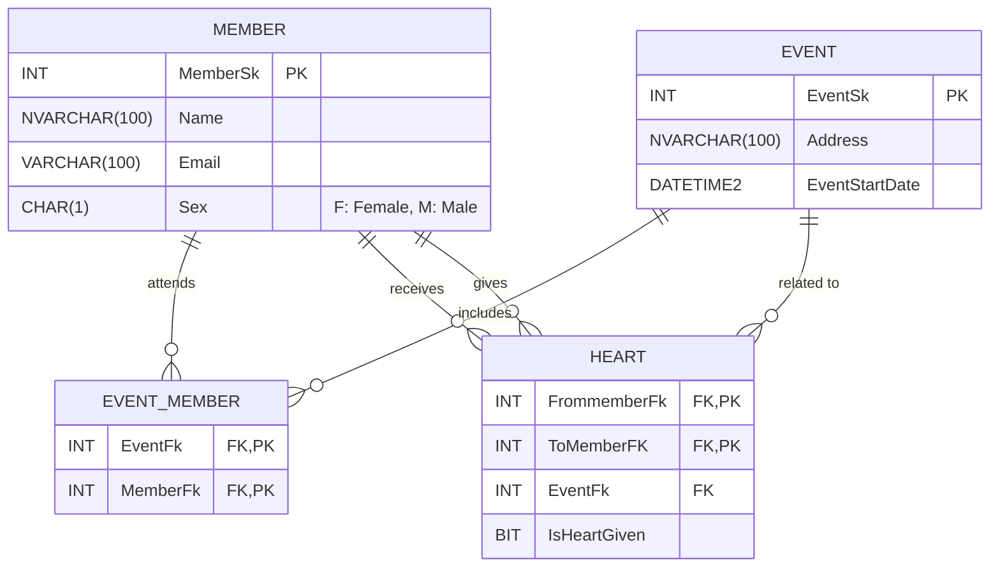

# Adatbázis séma diagram

```mermaid
erDiagram
    MEMBER {
        INT MemberSk PK
        NVARCHAR(100) Name
        VARCHAR(100) Email
        CHAR(1) Sex "F: Female, M: Male" 

    }

    EVENT{
        INT EventSk PK
        NVARCHAR(100) Address
        DATETIME2 EventStartDate
    }

    EVENT_MEMBER{
        INT EventFk FK, PK
        INT MemberFk FK, PK
    }

    HEART{
        INT FrommemberFk FK, PK
        INT ToMemberFK FK, PK
        INT EventFk FK
        BIT IsHeartGiven
    }

    EVENT ||--o{ EVENT_MEMBER : includes
    MEMBER ||--o{ EVENT_MEMBER : attends
    MEMBER ||--o{ HEART : receives
    MEMBER ||--o{ HEART : gives
    EVENT ||--o{ HEART : "related to"
```
